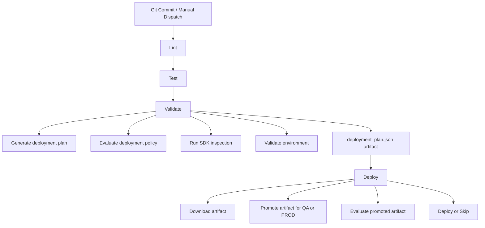
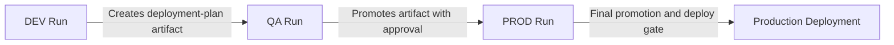
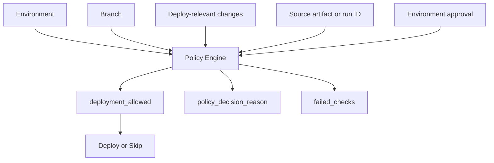

# Fabric CI/CD Pipeline Demo

## Overview

This project demonstrates a **production-style CI/CD pipeline** using:

* Fabric CLI
* Fabric-CICD Python SDK
* GitHub Actions
* Policy-driven deployment logic

The pipeline evolves from basic command execution into a **modular, environment-aware, and policy-governed deployment system**.

---

## Architecture Overview

This repository implements a **policy-driven, artifact-based CI/CD pipeline** for Microsoft Fabric using GitHub Actions.

The design separates:

- **pipeline execution** from **deployment decision logic**
- **artifact generation** from **artifact promotion**
- **environment behavior** across **DEV**, **QA**, and **PROD**

---

## Pipeline Flow

The pipeline follows a staged execution model where code quality, validation, policy evaluation, and deployment are separated into distinct phases.



---

## Promotion Flow

Deployment promotion follows a controlled progression from **DEV → QA → PROD**, with approval gates and artifact reuse between stages.



---

## Policy Decision Model

Deployment behavior is controlled through a centralized policy engine.



---

## Key Features

### 1. Multi-Stage CI/CD Pipeline

```text
lint → test → validate → deploy
```

* **Linting (Ruff)** ensures code quality
* **Unit tests (pytest)** validate behavior
* **Validation stage** evaluates environment and deployment plan
* **Deploy stage** executes only when policy allows

---

### 2. Environment-Aware Behavior

The pipeline supports:

* `dev` → generates the canonical deployment artifact  
* `qa` → promotes the artifact with approval gating  
* `prod` → performs final promotion and deployment decision  

Environment is controlled via:

```yaml
workflow_dispatch → fabric_env input
```

---

### 3. Policy-Driven Deployment

Deployment rules are centralized in:

```text
policies/deployment_policy.json
```

Example:

```json
{
  "dev": {
    "require_main_branch": false,
    "require_deploy_relevant_changes": false,
    "require_approval": false
  },
  "qa": {
    "require_main_branch": true,
    "require_deploy_relevant_changes": true,
    "require_approval": true
  },
  "prod": {
    "require_main_branch": true,
    "require_deploy_relevant_changes": true,
    "require_approval": true
  }
}
```

A Python policy evaluator determines:

* whether deployment is allowed
* which checks failed
* why the decision was made

---

### 4. Change Detection (Git + SDK)

The pipeline detects changes using:

* Fabric SDK (`get_changed_items`)
* Git diff (`git diff --name-only`)

Changes are classified as:

* **Deploy-relevant**
* **Non-deploy**

---

### 5. Deployment Plan Artifact

Each run generates:

```text
artifacts/deployment_plan.json
```

This includes:

* environment
* branch
* changed files
* deploy relevance
* policy decision
* reasoning

Example:

```json
{
  "environment": "qa",
  "branch": "main",
  "deploy_relevant": true,
  "deployment_allowed": true,
  "policy_decision_reason": "Deployment requires approval."
}
```

---

### 6. Artifact Promotion (Cross-Run)

The pipeline supports **cross-run artifact promotion**, allowing QA and PROD deployments to consume artifacts generated in prior runs.

- DEV → generates `deployment_plan.json`
- QA → downloads and promotes artifact using `source_run_id`
- PROD → promotes artifact and applies final deployment decision

Promotion is implemented via:

```text
scripts/download_promoted_artifact.py
scripts/promote_deployment_plan.py
scripts/evaluate_promoted_artifact.py
```

---

### 7. GitHub Actions Job Summary

Each run produces a **human-readable summary** directly in the Actions UI:

* environment
* changed files
* deploy-relevant files
* policy decision
* deployment outcome

---

### 8. Reusable Composite Action

The pipeline extracts logic into a reusable component:

```text
.github/actions/deployment-plan/
```

This action:

* sets up Python
* installs dependencies
* detects changes
* generates deployment plan
* exposes `deployment_allowed`

This enables reuse across workflows and projects.

---

### 9. Deployment Safety Controls

Deployment only proceeds when:

* environment is `prod`
* branch is `main`
* deploy-relevant changes exist
* policy allows deployment
* GitHub Environment approval is granted

---

## Project Structure

```text
.github/
  workflows/
  actions/
    deployment-plan/

configs/
  dev/
  prod/

policies/
  deployment_policy.json

scripts/
  create_slice.py
  detect_changed_items.py
  download_promoted_artifact.py
  evaluate_deployment_policy.py
  evaluate_promoted_artifact.py
  generate_deployment_plan.py
  promote_deployment_plan.py
  validate_fabric_env.py

tests/
  test_create_slice.py
  test_detect_changed_items.py
  test_download_promoted_artifact.py
  test_evaluate_deployment_policy.py
  test_evaluate_promoted_artifact.py
  test_generate_deployment_plan.py
  test_promote_deployment_plan.py
  test_validate_env.py

artifacts/ (generated at runtime)
```

---

## Design Decisions

This project intentionally adopts several architectural patterns commonly used in enterprise CI/CD systems.

### Artifact-Based Deployment

Rather than recomputing deployment decisions at deploy time, the pipeline generates a `deployment_plan.json` artifact during validation.

This ensures:
- consistent deployment inputs across environments
- reproducibility of deployment decisions
- separation of build and deploy concerns

### Cross-Run Artifact Promotion

Higher environments (QA and PROD) consume artifacts generated in prior runs using `source_run_id`.

This models real-world promotion pipelines where:
- DEV produces a candidate artifact
- QA validates and promotes it
- PROD performs final gated deployment

### Policy-Driven Deployment Logic

Deployment rules are centralized in `deployment_policy.json` and evaluated via a dedicated policy engine.

This avoids:
- duplicating logic in workflow YAML
- hardcoding environment conditions
- tightly coupling deployment logic to pipeline structure

### Separation of Concerns

The pipeline is intentionally divided into:

- **scripts/** → execution logic  
- **policies/** → decision rules  
- **workflows/** → orchestration  
- **artifacts/** → deployment state  

This makes the system:
- testable
- modular
- easier to extend

### Reusable Workflow Components

Deployment planning logic is extracted into a composite GitHub Action.

This allows:
- reuse across workflows
- cleaner pipeline definitions
- easier maintenance

---

## Key Concepts Demonstrated

* CI/CD pipeline design
* Policy-based deployment decisions
* Environment-aware configuration
* Change-based deployment gating
* Artifact-driven workflows
* Reusable GitHub Actions
* Separation of concerns (policy vs execution)
* Cross-run artifact promotion
* Artifact-based deployment gating

---

## Future Enhancements

* GitHub Environments with required reviewers
* Secrets management for real deployments
* Promotion model (dev → prod)
* Matrix testing across environments
* Reusable workflows across repositories

---

## Key Takeaway

This project demonstrates how to move from simple automation to a **structured, policy-driven CI/CD system** that separates decision logic, execution, and environment behavior.

---

## Status


